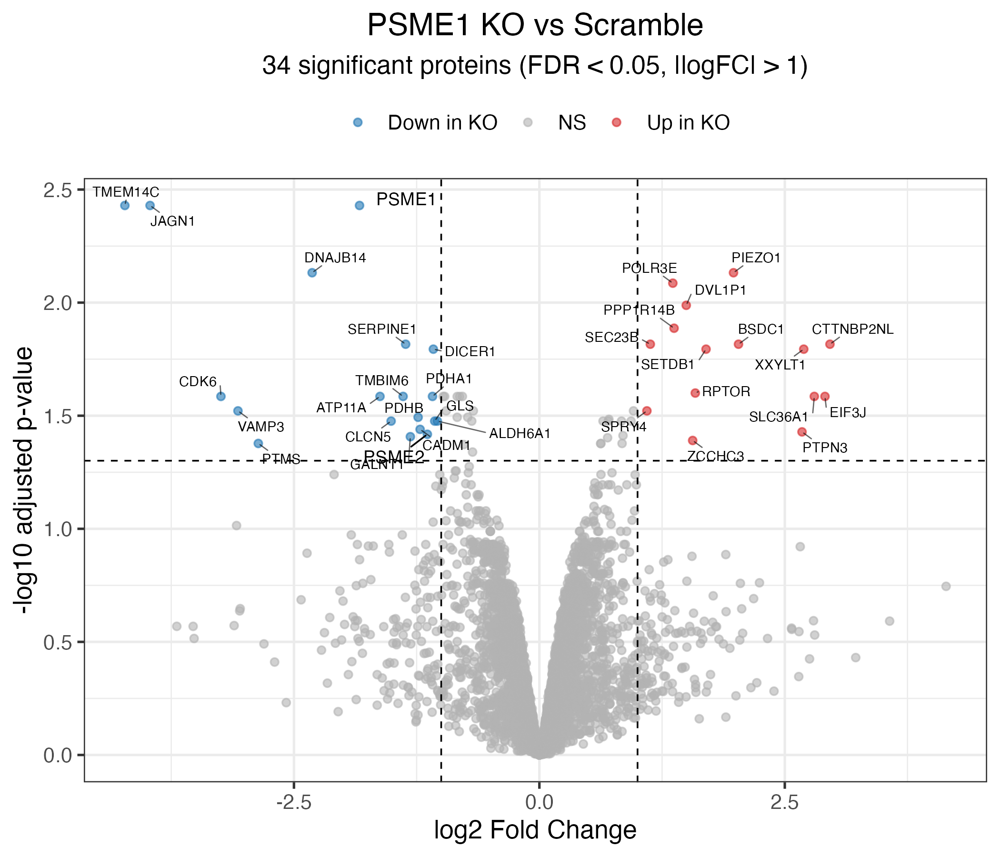
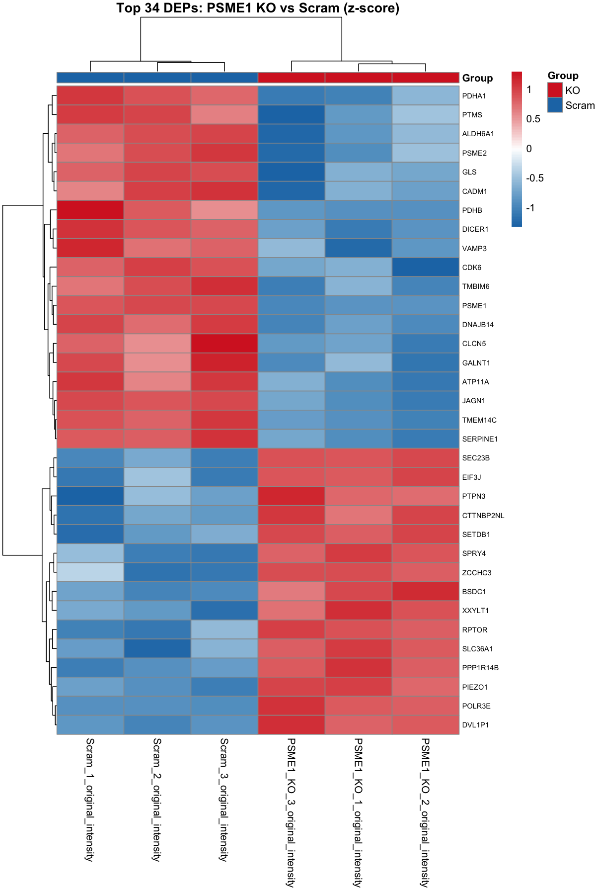

# PSME1 Knockdown vs Scram Differential Expression Analysis
A small scale analysis using triplicate siRNA knowndown expression data gathered
from NCI-H441 adenocarcinoma cells. The initial data is unnormalized. 

## Project Tree

```
├── data
│   └── raw
│       ├── KD_results.csv
│       ├── psme1_vs_scram.csv
│       └── PSME1_vs_scram_raw.csv
├── README.md
├── results
│   ├── DEA_results.csv
│   ├── DEA_results_annotated.csv
│   ├── psme1_kd_heatmap.pdf
│   ├── psme1_kd_volcano_plot.pdf
│   ├── psme1_vs_scram_normalized.csv
│   └── QC_sample_stats.csv
└── scripts
    ├── 00_csv_prep.py
    ├── 01_normalizer.py
    ├── 02_pro_namer.py
    ├── 03_norm_checker.py
    └── de_analysis.R
...
```

## PSME1_KD_vs_Scram_Differential_Expression



## PSME1_KD_vs_Scram_Heatmap

